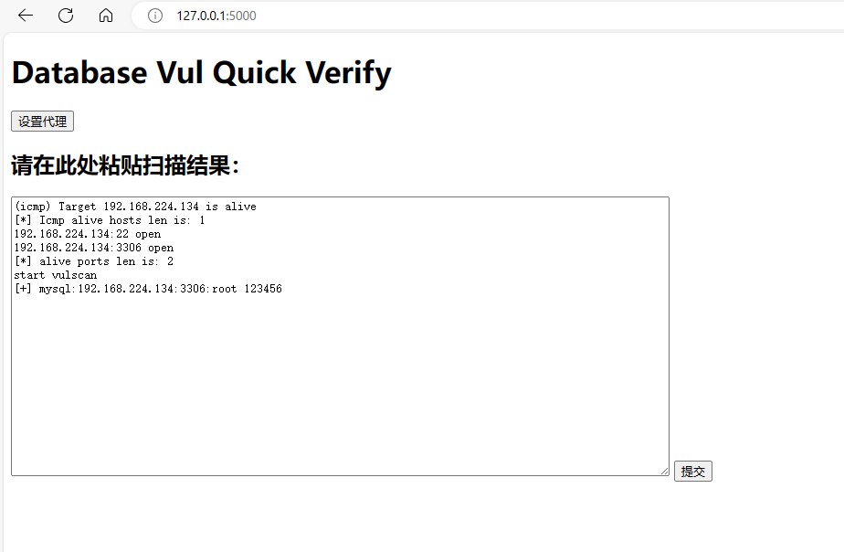
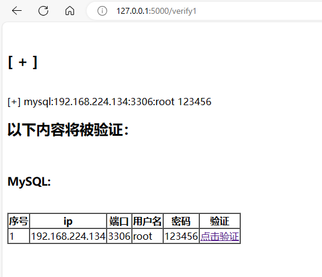
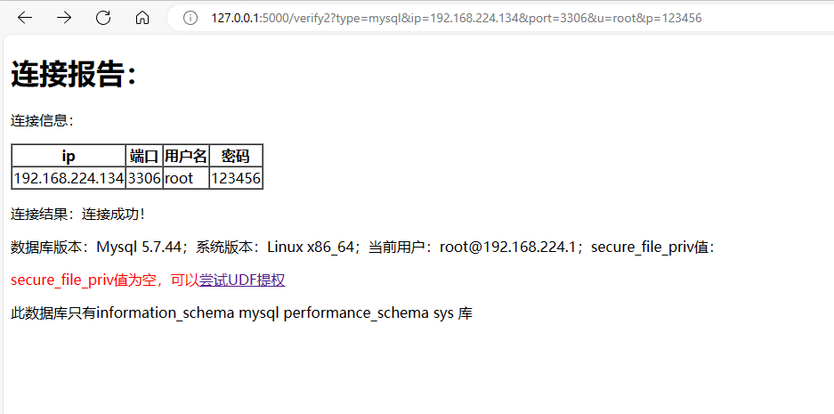
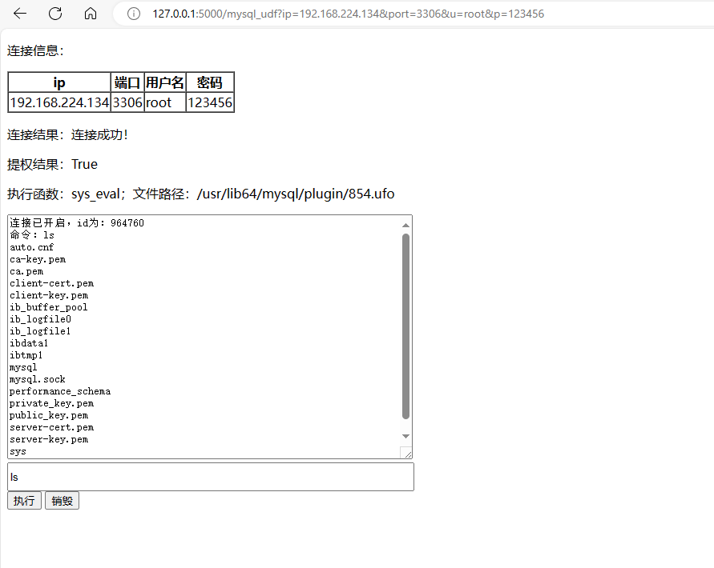

一个简单的数据库验证程序，可以通过粘贴fscan的结果，对数据库概况进行了解，方便报告截图

仅供学习研究使用，严禁用于非法用途，否则后果自负

使用方法：
```bash
pip3 install -r requirements.txt
python3 start.py
```

目前已经完成的功能：

mysql:
- [x] 数据库概况
- [x] 数据库表概况
- [x] 5.1版本以上的udf提权并执行命令

TODO:
太多了，慢慢来吧

截图：

起始页面：



验证前确认：



验证页面：



udf提权：

